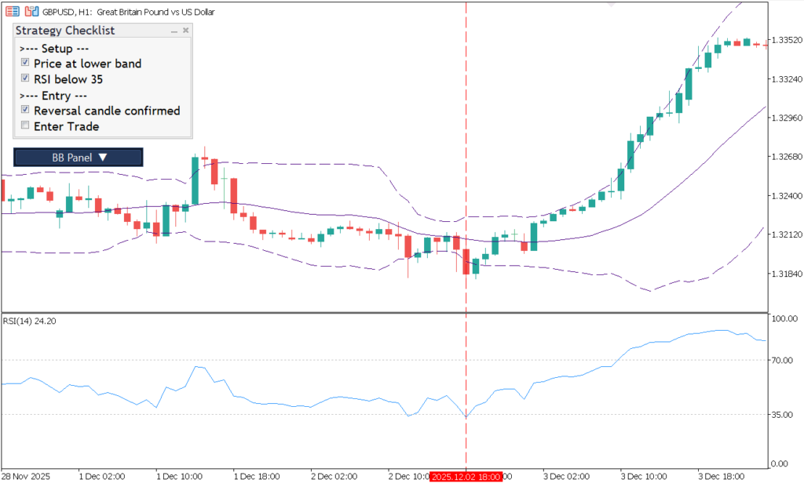
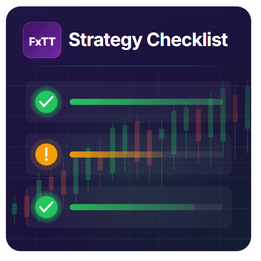

# FxTT Strategy Checklist MT5 — Free On-Chart Trading Checklist

[](#compatibility) [](#repository-structure) [](#version-and-changelog) [](#license) [](#overview)

> A free MetaTrader 5 indicator that keeps your trading rules visible on the chart. Define up to 20 checks, group them with section headers, and tick each rule manually before you open a trade.



## Overview

**FxTT Strategy Checklist MT5** is a manual discipline and workflow indicator for discretionary trading. It displays an interactive panel on the chart, with one checkbox for each rule and text labels for section headers. Use it to make a written process visible while you analyze a setup and to reduce decisions based on memory or emotion.

The indicator does not generate signals, place orders, modify positions, or communicate with a broker. You define the checklist in the Inputs tab and mark the items yourself.

Product page: [Strategy Checklist for MetaTrader 5](https://forextradingtools.eu/en/marketplace/strategy-checklist)

## Features

- On-chart interactive checklist dialog
- Up to 20 configurable checklist lines
- Section headers using a leading `>` character (for example, `>--- Setup ---`)
- State persistence per symbol, with optional per-timeframe separation
- Configurable chart corner, width, margins, padding, row height, and row spacing
- Configurable font, size, checkbox colours, section colour, title colour, and tooltips
- Multiple instances on one chart with unique `TAG` values
- Visual-only operation: no orders, alerts, or broker actions



## Installation

### Using the compiled release

1. Download [`FXTT_StrategyChecklist.ex5`](releases/FXTT_StrategyChecklist.ex5) from this repository's [Releases](https://github.com/ForexTradingTools/fxtt-mt5-strategy-checklist/releases) page.
2. In MetaTrader 5, open **File → Open Data Folder**.
3. Open `MQL5/Indicators/` and copy `FXTT_StrategyChecklist.ex5` into it.
4. Restart MetaTrader 5, or right-click the Navigator panel and choose **Refresh**.
5. Find **FXTT_StrategyChecklist** under **Navigator → Indicators** and attach it to a chart.
6. Set your checklist items in the Inputs tab, then click **OK**.

### Compiling from source

The complete source is [`src/FXTT_StrategyChecklist.mq5`](src/FXTT_StrategyChecklist.mq5). Open it in MetaEditor, compile it, and place the generated `.ex5` file in the terminal's `MQL5/Indicators/` folder. The source uses the standard MQL5 Controls library (`Dialog`, `CheckBox`, and `Label`) and has no private include-file dependency.

## Settings reference

All settings are available when the indicator is attached to a chart.

### General

| Parameter | Default | Description |
|---|---:|---|
| `TAG` | `FxTT_SC_` | Prefix used for chart objects. Give each instance on the same chart a different value. |

### Layout

| Parameter | Default | Description |
|---|---:|---|
| `Location` | `CORNER_RIGHT_LOWER` | Chart corner used to position the dialog. |
| `DialogWidth` | `280` | Dialog width in pixels. |
| `MarginFromEdge` | `20` | Distance from the selected chart edges in pixels. |
| `InnerPaddingX` | `8` | Horizontal padding inside the dialog in pixels. |
| `InnerPaddingY` | `6` | Vertical padding inside the dialog in pixels. |
| `RowHeight` | `24` | Height of each checklist row in pixels. |
| `RowSpacing` | `2` | Additional gap between rows in pixels. |

### Appearance

| Parameter | Default | Description |
|---|---:|---|
| `FontName` | `Segoe UI` | Font used by checklist rows and section labels. |
| `FontSize` | `9` | Font size. |
| `CheckedColor` | `clrLimeGreen` | Colour applied to a checked item. |
| `UncheckedColor` | `clrBlack` | Colour applied to an unchecked item. |
| `SectionColor` | `clrGold` | Colour used for section-header labels. |
| `TitleColor` | `clrBlack` | Title colour input retained by the indicator configuration. |
| `ShowTooltips` | `true` | Shows a toggle tooltip for checkbox rows when enabled. |

### Persistence

| Parameter | Default | Description |
|---|---:|---|
| `SavePerSymbol` | `true` | Include the current symbol in the saved-state key. |
| `SavePerTimeframe` | `false` | Also include the current chart timeframe in the saved-state key. |

The state file is stored in the terminal's MQL5 file area under `SChecklist`. With the defaults, each symbol has its own saved checklist state. Set both options to `false` if one shared state is preferred.

### Checklist items

| Parameters | Default | Description |
|---|---|---|
| `Check01` … `Check20` | See source defaults | Up to 20 lines. Empty strings are omitted. A line beginning with `>` is rendered as a section label rather than a checkbox. |

The supplied defaults include `>--- Setup ---`, `Trend confirmed`, `Structure respected`, `>--- Entry ---`, `Signal candle closed`, and `Risk/Reward >= 1:2`; edit them to match your own trading plan.

## How to use it

1. Write objective setup, entry, risk, and exit rules in `Check01` through `Check20`.
2. Add section labels with a leading `>` to divide the workflow into readable blocks.
3. Attach the indicator before analyzing a trade.
4. Check each applicable rule manually as it is confirmed.
5. Use the completed panel as a record of whether the setup met your written process before placing any order in your separate trading workflow.

The panel is sized from the number of non-empty checklist lines. Section labels occupy a row but are not interactive. State is restored when the same symbol (and, when enabled, timeframe) is loaded again.

## Compatibility

- **Platform:** MetaTrader 5 (MT5)
- **File type:** `.ex5` compiled indicator or `.mq5` source
- **Terminal components:** Standard MQL5 Controls library included with MetaTrader 5
- **Charts:** Any MT5-supported symbol and timeframe
- **Operating environments:** MT5 on Windows and compatible MT5 VPS/Wine setups
- **MT4:** Not compatible; this repository contains the MQL5 implementation only
- **Trading automation:** Visual/manual tool; it does not place or manage trades

## Version and changelog

### Version 3.0

The source declares version `3.0`; the matching compiled release is supplied at `releases/FXTT_StrategyChecklist.ex5`.

### Version 1.00 — 2023-12-09

- Initial public release of Strategy Checklist.
- Added an on-chart checklist dialog with customizable sections and rule items.
- Added persistent checklist state for repeatable trading workflows.

## Repository structure

```text
fxtt-mt5-strategy-checklist/
├── src/
│   └── FXTT_StrategyChecklist.mq5       # Complete MQL5 source
├── releases/
│   └── FXTT_StrategyChecklist.ex5       # Compiled MT5 indicator
├── screenshots/
│   ├── strategy-checklist-featured.png  # Product preview
│   └── strategy-checklist-mt5-chart.png # Indicator on an MT5 chart
├── LICENSE
└── README.md
```

## Related FxTT repositories

The public FxTT indicator family is split across these repositories:

- [FxTT MT4 MTF Bollinger Bands](https://github.com/ForexTradingTools/fxtt-mt4-mtf-bollinger-bands)
- [FxTT MTF Bollinger Bands MT5](https://github.com/ForexTradingTools/fxtt-mt5-mtf-bollinger-bands)
- [FxTT MT4 MTF Triple Moving Averages](https://github.com/ForexTradingTools/fxtt-mt4-mtf-triple-moving-averages)
- [FxTT Strategy Checklist MT4](https://github.com/ForexTradingTools/fxtt-mt4-strategy-checklist)
- [FxTT MT4 Forex Scanner](https://github.com/ForexTradingTools/fxtt-mt4-forex-scanner)
- [FxTT MT5 Forex Scanner](https://github.com/ForexTradingTools/fxtt-mt5-forex-scanner)
- [FxTT MTF Triple Moving Averages MT5](https://github.com/ForexTradingTools/fxtt-mt5-mtf-triple-moving-averages)
- [FxTT Pivot Points MT5](https://github.com/ForexTradingTools/fxtt-mt5-pivot-points)
- [FxTT Session High/Low MT5](https://github.com/ForexTradingTools/fxtt-mt5-session-high-low)
- [FxTT News Calendar MT5](https://github.com/ForexTradingTools/fxtt-mt5-news-calendar)
- [FxTT ZigZag Zones MT5](https://github.com/ForexTradingTools/fxtt-mt5-zig-zag-zones)

## License

This project is licensed under the [MIT License](LICENSE). You may use, modify, and distribute the code and compiled release subject to the license terms.
